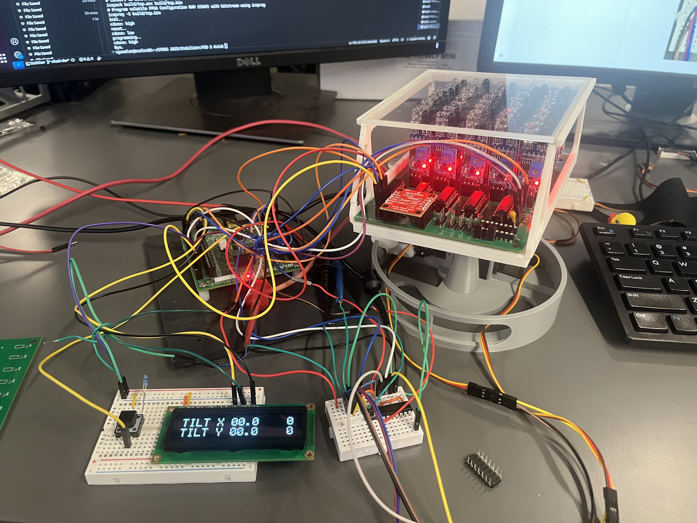
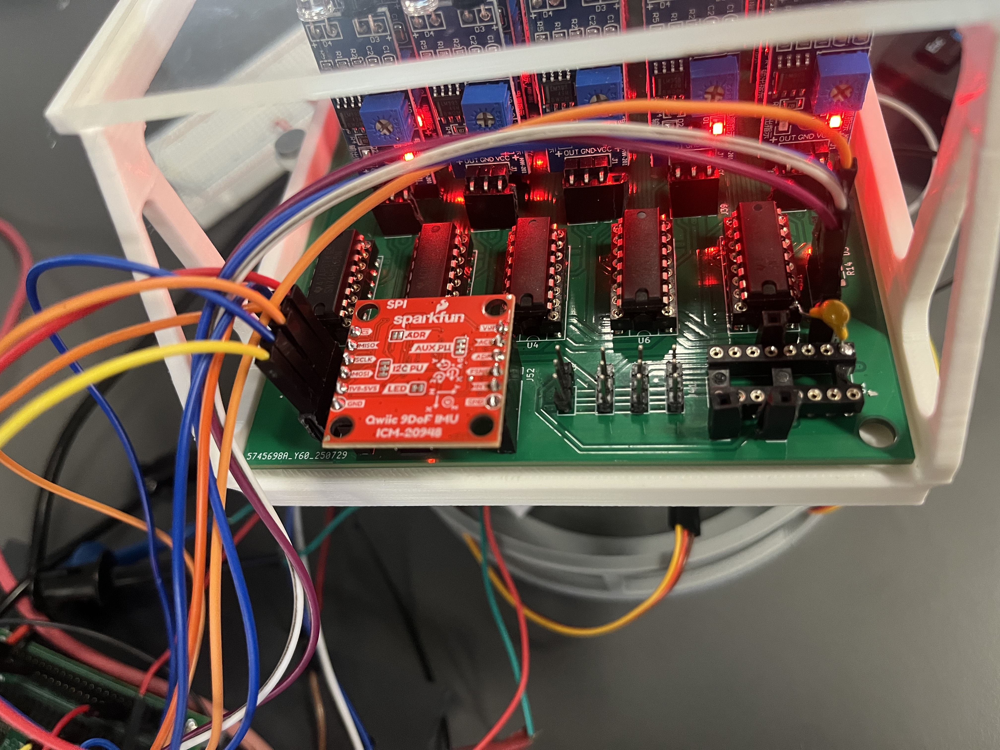
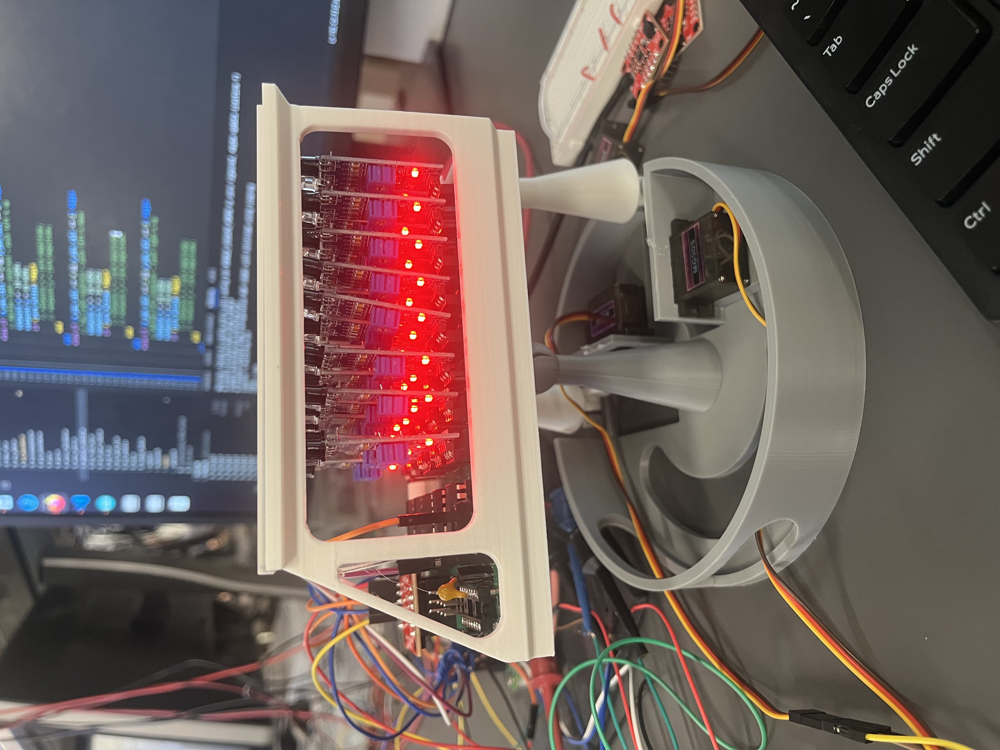
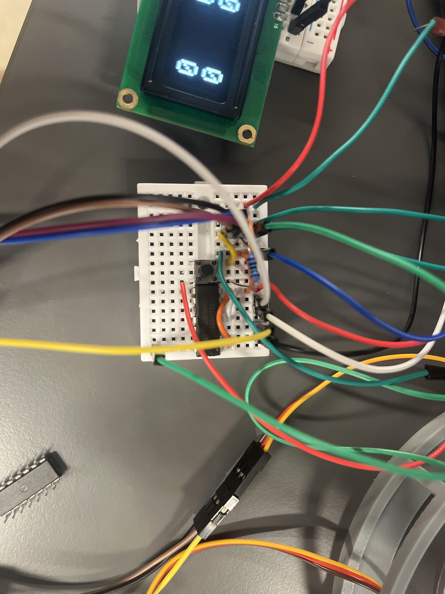
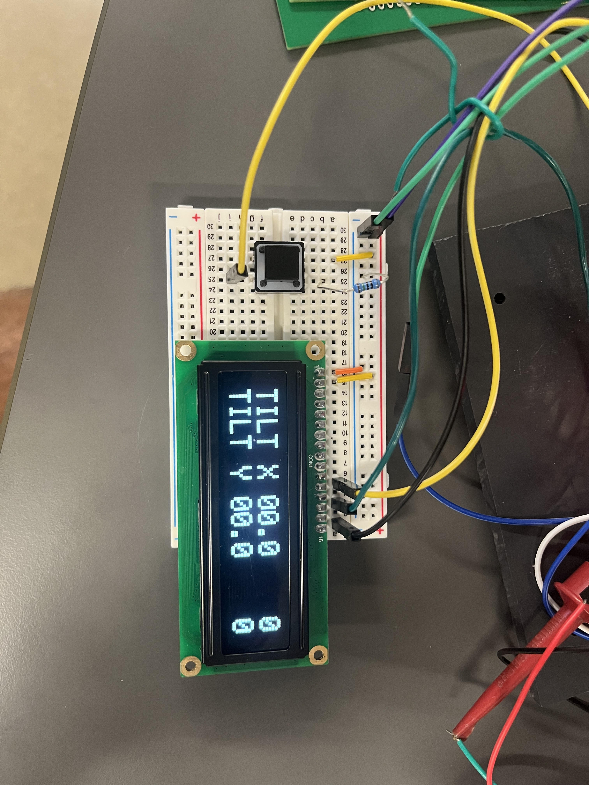

# Polaris

## Team 02 - STARS Stabilizers
- **Peer Mentor:** [LinkedIn](https://www.linkedin.com/in/johnny-hazboun/) - Johnny Hazboun  
- [LinkedIn](https://www.linkedin.com/in/vikash-gunalan/) - Vikash Gunalan  
- [LinkedIn](https://www.linkedin.com/in/soumilverma/) - Soumil Verma

## Project Overview
We present Polaris! Polaris is a 2D Ball Balancer that was designed by STARS 2025 Team 2 by Vikash and Soumil.

## Pin Layout
## External Hardware

3D Printed Components: Seen above.
LCD Display: TFT 1602, Seen above.
Custom PCB:

IMU: ICM-20948
https://invensense.tdk.com/wp-content/uploads/2024/03/DS-000189-ICM-20948-v1.6.pdf 
IR Sensor: MH Flying Fish
Shift Registers: SNx4AHC125 Quadruple Bus Buffer Gates With 3-State Outputs                                                                                                                                              
https://www.ti.com/lit/ds/symlink/sn74ahc125.pdf 
Level Shifter: SNx4HC125 Quadruple Buffers with 3-State Outputs
https://www.ti.com/lit/ds/symlink/sn74hc125.pdf?ts=1754597629858&ref_url=https%253A%252F%252Fwww.ti.com%252Fproduct%252FSN74HC125 

Breadboarding / Wiring

 

## Functionality Description and Testing
This project is automatic! All the user has to do is turn it on with the “enable” button and reset it if they want to. After that simply, place a ping pong ball on the platform (or lightly lob it onto the platform) and the platform will adjust to try to bring it to the center. If it is unable to, adjust the setpoint and PID gains. 

## RTL Diagrams
Only the top level and SPI RTLs are shown here. Click [here](https://drive.google.com/file/d/1eGJFjpFtNKYYbWGMnWZV2Z53K3y8pnwY/view?usp=sharing) for the full RTL diagram.

Top Level RTL:
.jpg)

SPI with IMU RTL:
.jpg)

